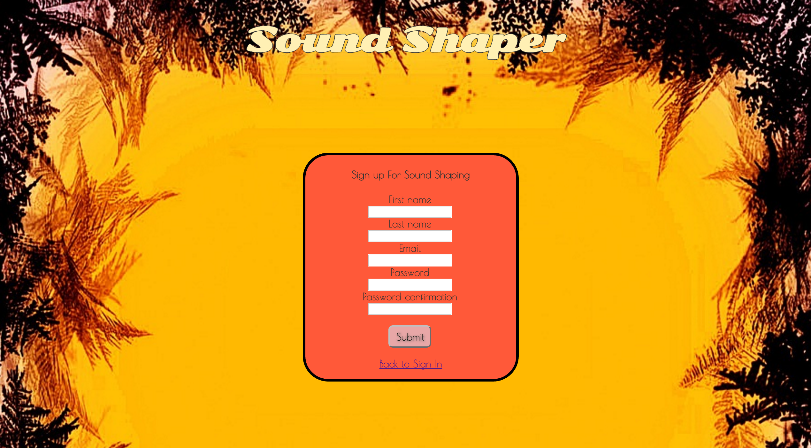
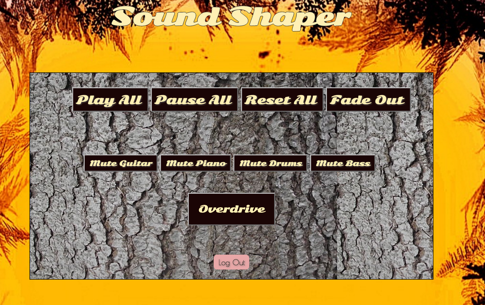

#Sound Shaper#

##Description##
Sound Shaper is an app that allows you to mix uploaded audio tracks to a song by isolating individual tracks, adding overdrive, and fade-outs. With proper manipulations of the buttons it also allows you to create delay and tremelo effects on the individual tracks. 

##User Stories##
This application allows user to sign up with an e-mail and password, and sign in to access the features of the app. Once The user signs in they will be able to play a song with four individual tracks: guitar, piano, drums, and bass. By pressing the labeled buttons on the page they will be able to shape the sound by muting individual tracks and adding overdrive to the guitar. Users can also play, pause and fade out all tracks.  

##Technology##
- Ruby on Rails
- HTML
- Sass/CSS
- JavaScript
- Heroku
- [Howler.js] (http://goldfirestudios.com/blog/104/howler.js-Modern-Web-Audio-Javascript-Library)
- [Pedalboard.js] (https://dashersw.github.io/pedalboard.js/)
- RuboCop

##Deployment Link##

- [Sound Shaper](https://nameless-bayou-39478.herokuapp.com/)

##Wireframes##

